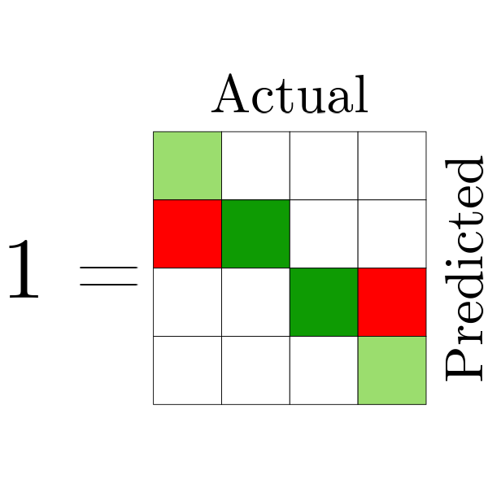
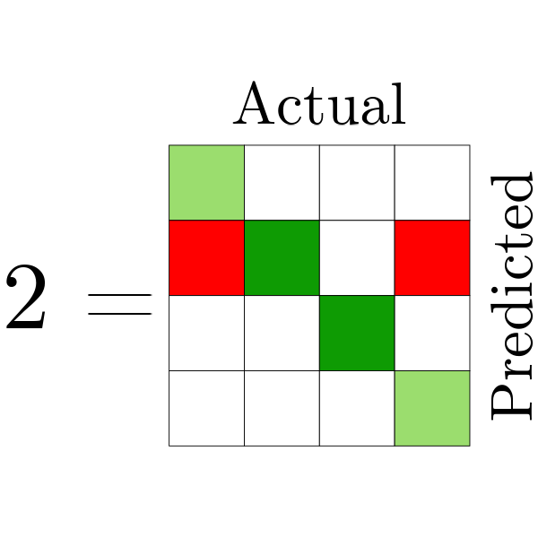
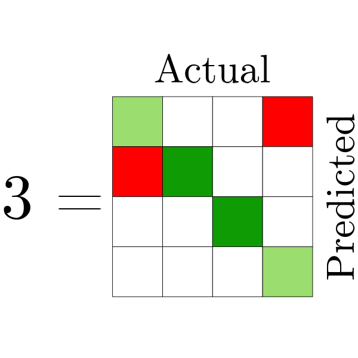
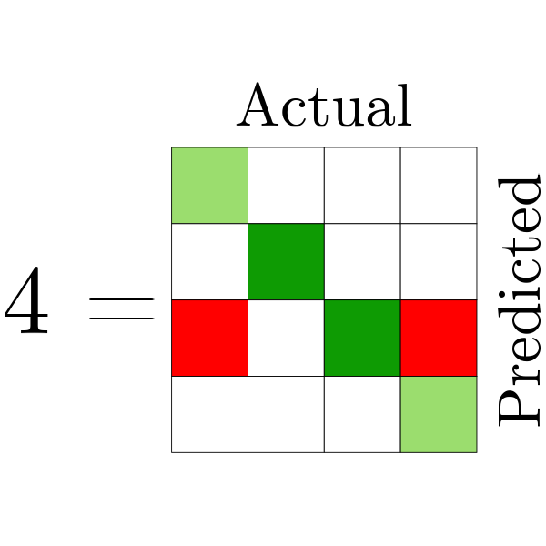
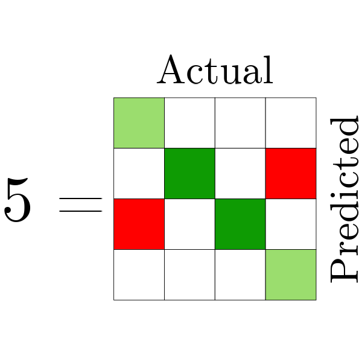
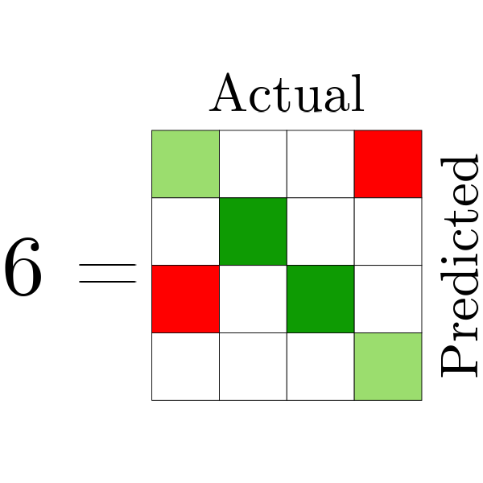
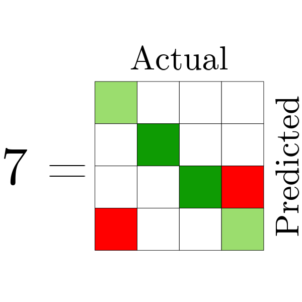
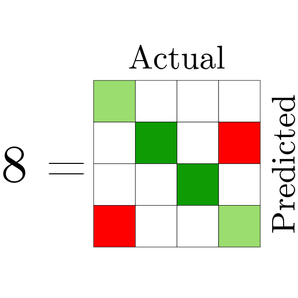
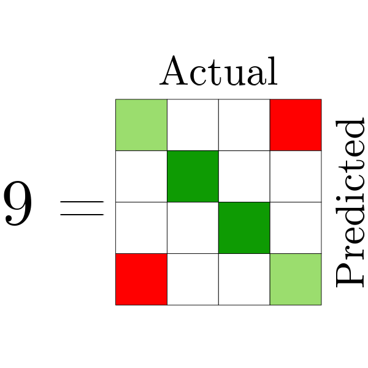

## Study D
```{r D: (Re)move Load packages, echo = F, message = FALSE, warning = F}
# load packages 
library("tidyverse")
library("effectsize")
library("afex")
library("ggplot2")
library("kableExtra")
library("tibble")
library("extrafont")
library("ggnewscale")
library("grid")
library("stringr")
library("MOTE")
library("ggtext") # for element_markdown() only for plot in D
```

```{r D: (Re)move Import APA style functions, echo = F}
source('./Apa-style.R')
```

```{r D: Import data, echo = F}
dataD <- readRDS("../4_Methodology/Preparation and Simulation Studies/SimDdata.RDS")
```

```{r D: Statistical analysis mixed model, message = F, echo = F}
# Mixed model with afex aov_ez()
# Defaults are: Effect size = Generalized eta-squared,
#               Sphericity correction on DF = Greenhouse-Geisser (more conservative than Hyunh-Feldt)
#               Sums of squares = Type 3 
# Note 1:        METRIC specified as 'within' to account for repeated nature / non-independence of error and
#               'observed' to avoid inflated effect sizes values because METRIC can be seen as a measured
#               rather than manipulated factor.

ModelD <- afex::aov_ez(data = dataD, id = "row" , dv = "y", between = c( "MISCL", "IR"), within = "METRIC", observed = "METRIC")
```

```{r D: Table preparation APA, echo = F}
# Table preparation
Tab_D <- ModelD$anova_table
Tab_D2 <- cbind(Tab_D[-c(1:3),-5],"ges"= Tab_D[-c(1:3),5])
Tab_D3 <- tibble::rownames_to_column(Tab_D2, var = "Predictor")

# Convert to APA style
Aov_Tab_D <- Tab_D3
Aov_Tab_D[,1] <- gsub(":", " × ", Aov_Tab_D[,1])
Aov_Tab_D[,4] <- Aov_Tab_D[,4]* 10^{6}
Aov_Tab_D[,c(2,3,5)] <- apply(Aov_Tab_D[,c(2,3,5)], c(1,2),  apa_above0)
Aov_Tab_D[,6] <- apa_p(Aov_Tab_D[,6])
Aov_Tab_D[,7] <- apa_below0(Aov_Tab_D[,7])
```

```{r D: Grand Mean and SD for METRIC (DMSDM), echo = F}
# Grand Mean and SD for METRIC (used in text)
DMSDM <- aggregate(y ~ METRIC, dataD, function(x) c(mean = mean(x), sd = sd(x)))
DMSDM$y[,"mean"] <- round(DMSDM$y[,"mean"], 2)
DMSDM$y[,"sd"] <- round(DMSDM$y[,"sd"], 3)
DMSDM$y[,"mean"] <- stringr::str_remove(DMSDM$y[,"mean"], "^0+") # remove leading zero
DMSDM$y[,"sd"] <- stringr::str_remove(DMSDM$y[,"sd"], "^0+")
```

<!-- Start section study D -->

The ANOVA results of study D are presented in Table 4. Two effects exceeded the moderate effect size threshold. However, all four effects are described in this section because the highest-order interaction almost reached moderate effect size ($\eta_g^2$ = .054) and offers valuable insights with practical implications to consider during metric selection. The main effect for METRIC was most substantial, indicated by its large effect size (*F*(`r Aov_Tab_D[Aov_Tab_D$Predictor %in% "METRIC",]["num Df"]`, `r Aov_Tab_D[Aov_Tab_D$Predictor %in% "METRIC",]["den Df"]`) = `r Aov_Tab_D[Aov_Tab_D$Predictor %in% "METRIC",]["F"]`, *p* `r Aov_Tab_D[Aov_Tab_D$Predictor %in% "METRIC",]["Pr(>F)"]`, $\eta_{g}^{2}$ = `r Aov_Tab_D[Aov_Tab_D$Predictor %in% "METRIC",]["ges"]`, \mbox{$\hat{\epsilon}$ = `r MOTE::apa(summary(ModelD$Anova)$pval.adjustments[1, "GG eps"],2, T)`}). The metrics varied in how high they scored the scenarios on average, and how much their scores varied between scenarios. The highest overall mean score was observed for nMCC~cb~ (*M* = `r DMSDM[DMSDM$METRIC %in% "MCC.cb",]$y[,"mean"]`, *SD* = `r DMSDM[DMSDM$METRIC %in% "MCC.cb",]$y[,"sd"]`), followed by nMCC (*M* = `r DMSDM[DMSDM$METRIC %in% "MCC",]$y[,"mean"]`, *SD* = `r DMSDM[DMSDM$METRIC %in% "MCC",]$y[,"sd"]`), Accuracy \mbox{(\textit{M} = `r DMSDM[DMSDM$METRIC %in% "Accuracy",]$y[,"mean"]`,} *SD* = `r DMSDM[DMSDM$METRIC %in% "Accuracy",]$y[,"sd"]`), and finally F1~m~ (*M* = `r DMSDM[DMSDM$METRIC %in% "F1m",]$y[,"mean"]`, *SD* = `r DMSDM[DMSDM$METRIC %in% "F1m",]$y[,"sd"]`). Accuracy was the only metric that scored each scenario with the same value. F1~m~ varied the most between scenarios, followed by nMCC and nMCC~cb~. The interaction effects described in the next paragraphs provide more context to the observed variation by revealing how the allocation of misclassifications and class imbalance influenced metrics evaluation scores. 

\newpage

```{r D: Presented Table, echo = F, message = F}
# ANOVA Table
knitr::kable(
  Aov_Tab_D,
  format = "latex",
  booktabs = TRUE,
  longtable = T,
  escape = FALSE,
  col.names = c('Predictor',
                '$\\mathit{df}_{\\text{num}}$',
                '$\\mathit{df}_{\\text{den}}$',
                '\\textit{MSE} × $10^{-6}$',
                '\\textit{F}',
                "\\textit{p}",
                "$\\eta_{g}^{2}$"),
  align = c("l", "c", "c", "c", "r", "c", "c"),
  digits = c(NA, 2, 2, 2, 2, 3, 2),
  caption = "Study D: ANOVA Table" ) %>%
  kable_styling(font_size = 10, position = "left") %>%
  row_spec(row = 0, align = "c")  %>%
  footnote( 
    general_title = "",
    escape = F,
    general = "\\\\hspace{-.28cm}\\\\begin{minipage}{\\\\linewidth}\\\\vspace{.4cm}\\\\textit{Note}. Due to the violation of sphericity $\\\\mathit{df}_{\\\\text{num}}$ and $\\\\mathit{df}_{\\\\text{den}}$ were corrected using Greenhouse-Geisser correction ($\\\\hat{\\\\epsilon}$ = 0.47).\\\\end{minipage}", # epsilon is manual
    threeparttable = T,
    footnote_as_chunk = TRUE)
```

```{r D: Plot preparation, message = F, echo = F}
# Plot preparation
plotdata <- dataD %>%
  group_by(IR, MISCL, METRIC) %>% # dit keer geen N anders verschil
  summarise(y = mean(y))

# Adjust factorlevels names
## IR
levels(plotdata$IR) <- c("1:1", "1:3", "1:30", "1:300")
## MISCL                                       
levels(plotdata$MISCL) <- 1:9
## METRIC 
plotdata$METRIC <- factor(plotdata$METRIC, 
                          labels = c('Accuracy' = 'Accuracy',
                                     'F1~m~' = parse(text = latex2exp::TeX('$F1_{m}$')),
                                     'MCC' = 'nMCC',
                                     'MCC.cb' = parse(text = latex2exp::TeX('$nMCC_{cb}$'))))

# Colored confusion matrix as label for MISCL
## Needs library ggtext and legend.text = element_markdown in theme
matrix_lbl <- c(
  "",
  "",
  "",
  "",
  "",
  "",
  "",
  "",
  ""
)

# Plot theme D
## Theme is different in study D compared to A-C
thm <- theme_bw()+
theme(text = element_text(family = "CM Roman", size = 9)) + # Old family: "sans"
theme(strip.background = element_blank(),
	  strip.text = element_text(size = 9, family = "CM Roman")) + 
theme(plot.caption.position = "plot") +
theme(plot.caption = ggtext::element_markdown(hjust = 0, size = 9, lineheight = 2.0, margin = margin(b = 2, t = 10), family="CM Roman")) + # Seems to do nothing for D
theme(axis.title = element_text(size = 9, family = "CM Roman")) +	  theme(legend.background = element_blank(),
      legend.box.background = element_rect(colour = "black", linewidth = 0.2),
      legend.key = element_rect(fill = "transparent", colour = NA), # added for D
      legend.key.width = unit(.8, "cm"), # added for D
      legend.margin = margin(t = 5, r = 5, b= 1, l= 5), # added for D
	  legend.text = element_markdown(size = 10, family = "CM Roman", margin = margin(t = -5, b = -1, l = 5)), # changed in D = element_markdown for image
      legend.title = element_text(size = 9, family = "CM Roman", margin = margin(b = 10))) # changed in D
```

The two-way interaction of METRIC and MISCL did exceed the moderate effect size threshold (*F*(`r Aov_Tab_D[Aov_Tab_D$Predictor %in% "MISCL × METRIC",]["num Df"]`, `r Aov_Tab_D[Aov_Tab_D$Predictor %in% "MISCL × METRIC",]["den Df"]`) = `r Aov_Tab_D[Aov_Tab_D$Predictor %in% "MISCL × METRIC",]["F"]`, *p* `r Aov_Tab_D[Aov_Tab_D$Predictor %in% "MISCL × METRIC",]["Pr(>F)"]`, $\eta_{g}^{2}$ = `r Aov_Tab_D[Aov_Tab_D$Predictor %in% "MISCL × METRIC",]["ges"]`, $\hat{\epsilon}$ = `r MOTE::apa(summary(ModelD$Anova)$pval.adjustments[1, "GG eps"],2, T)`). This result indicates that at least one metric was sensitive to which class(es) the instances were falsely assigned. Figure 8 reveals that F1~m~, nMCC, and nMCC~cb~ were sensitive to how misclassifications were allocated and that allocation 'preferences' (i.e., the relative ranking of allocation options) of the metrics differed. It was important to interpret these findings in relation to imbalance, given that the three-way interaction METRIC, MISCL, and IR (*F*(`r Aov_Tab_D[Aov_Tab_D$Predictor %in% "MISCL × IR × METRIC",]["num Df"]`, `r Aov_Tab_D[Aov_Tab_D$Predictor %in% "MISCL × IR × METRIC",]["den Df"]`) = `r Aov_Tab_D[Aov_Tab_D$Predictor %in% "MISCL × IR × METRIC",]["F"]`, *p* `r Aov_Tab_D[Aov_Tab_D$Predictor %in% "MISCL × IR × METRIC",]["Pr(>F)"]`, $\eta_{g}^{2}$ = `r Aov_Tab_D[Aov_Tab_D$Predictor %in% "MISCL × IR × METRIC",]["ges"]`, $\hat{\epsilon}$ = `r MOTE::apa(summary(ModelD$Anova)$pval.adjustments[1, "GG eps"],2, T)`) almost reached the moderate effect size threshold, and because of the practical implications this interaction entails. The three-way interaction indicates that allocation preferences changed for some metrics with different levels of class imbalance. Figure 8 shows that only the preferences of F1~m~ and nMCC were affected by imbalance, and their preferences were more pronounced in scenarios with more imbalance. The two-way interaction of METRIC and IR was less strong ($\eta_g^2$ = .04). F1~m~ and nMCC scores followed the same pattern with lower scores on average in scenarios with more imbalance, though F1~m~ with a slightly steeper slope. Hence, the essential part of the effect of imbalance was in relation to the interaction of metric type and misclassification type, because for some metrics it altered their preferences for allocating misclassifications. In the subsequent paragraphs the different metrics' preferences and the relation with class imbalance are described.  \

```{r D: Plot 1, fig.cap= "Study D: Mean Value of Metrics for Each Misclassification Type, Demonstrating Nine Distinct Allocation Options, While Varying the Imbalance Ratios", echo = F}
# https://stackoverflow.com/questions/69868229/caption-at-the-top-of-the-image-option-from-chunk-rmardown

# Plot 1 (comments kunnen weg bij final)
ggD <- ggplot2::ggplot(plotdata, aes(y = y, x = IR,  group = MISCL, col = MISCL)) +
#    geom_point(size=3)+
#   scale_color_manual(values = c("aquamarine4","orange1", "gray62","yellow2", "coral1", "turquoise","purple","royalblue4", "deeppink2"))+
# guides(colour = guide_none())+
#  new_scale_color() +
  stat_summary(fun = "mean", geom = "line", aes(y = y, col = factor(MISCL))) +
# Note to self: mogelijk statsummary point aanpassen en geom-poiny hierboven verwijderen om de juiste points te krijgen. Ik wil dan zo groot mogelijke bolletjes maar wel onderscheid kunnen zien. Bv zwarte bolletjes en dan grote stroke met kleur. 
# stat_summary(fun="mean", geom="point", size = 1.5, stroke = 0.5, shape = 21, aes(y=y, fill=factor(MISCL)), col = "black") +
  stat_summary(fun = "mean", geom = "point", size = 3, aes(y = y, col = factor(MISCL))) +
  stat_summary(fun = "mean", geom = "point", size = 1.5, stroke = 0.5, shape = 21, aes(y = y, fill = factor(MISCL)), col = "black") +
#  stat_summary(fun="mean", geom="point", size = 1.5, col = "black") +
  xlab("Imbalance ratio (IR)") +
  ylab("Mean evaluation score") +
 ylim(0.55,.9) + 
  scale_fill_manual(guide = guide_legend(order = 4),values = c("aquamarine4","orange1", "gray62","yellow2", "coral1", "turquoise","purple","royalblue4", "deeppink2"), label = matrix_lbl, name = "Misclassification type (MISCL)") +
  scale_colour_manual(guide = guide_legend(order = 4), values = c("aquamarine4","orange1", "gray62","yellow2", "coral1", "turquoise","purple","royalblue4", "deeppink2"), label = matrix_lbl, name = "Misclassification type (MISCL)") +
  theme(legend.key=element_rect(fill=NA)) +
  facet_wrap(~ METRIC, labeller = label_parsed) + 
  thm

ggD # Plot 1
```

\vspace{-10pt}
\noindent \small \textit{Note}. The misclassification types are represented by a number and a colored confusion matrix. The numbers correspond with the misclassification matrices $\textbf{M}_{1,2,\ldots,9}$ on pages 22-23. The colored confusion matrices provide a visual representation of the underlying misclassification pattern, where dark green ($\,\fcolorbox[RGB]{153,153,153}{14,155,3}{\phantom{X}}\,$) indicates 100\% recall for that class, light green ($\,\fcolorbox[RGB]{153,153,153}{155,221,110}{\phantom{X}}\,$) indicates 50\% recall for that class, red ($\,\fcolorbox[RGB]{153,153,153}{255,0,0}{\phantom{X}}\,$) indicates the class to which the misclassifications were assigned, and white ($\,\fcolorbox[RGB]{153,153,153}{255,255,255}{\phantom{X}}\,$) indicates no predictions. \normalsize \

Focusing on F1~m~ first, Figure 8 demonstrates that F1~m~'s preferences were more pronounced and wide-ranging as imbalance was more severe. In severe and extreme imbalanced scenarios, the allocation options were ranked as follows^[The numbers correspond to the nine misclassification types and they were ordered based on mean scores of the metric in question. In cases where mean scores for different misclassification types of one metric overlap in Figure 8, an approximately-equal symbol ($\approx$) was used to seperate these types in the presented ranking.]\mbox{: 4 $\approx$ 7 > 1 > 9 $\approx$ 6 > 3 > 5 $\approx$ 8 $\approx$ 2.} Majority misclassifications were preferentially assigned to the other majority class \mbox{(MISCL: 4 $\approx$ 7),} followed by a minority class with compromised recall \mbox{(MISCL: 9 $\approx$ 6 and 3),} while the least favored option was a minority class with perfect recall \mbox{(MISCL: 5 $\approx$ 8 $\approx$ 2).} Minority misclassifications were also preferentially assigned to a majority class \mbox{(MISCL: 4 $\approx$ 7 and 9 $\approx$ 6)} over a minority class \mbox{(MISCL: 1 and 3)}, but this only influenced F1~m~'s ranking among scenarios with identical allocation of majority misclassifications. When class imbalance was mild, the ranking of allocation options \mbox{(MISCL: 4 $\approx$ 7 > 9 $\approx$ 1 $\approx$ 6 > 8 $\approx$ 2 $\approx$ 5 > 3)} was similar, but the differences between them were less distinct. F1~m~'s ranking differed in balanced scenarios \mbox{(MISCL: 4 > 9 $\approx$ 7 $\approx$ 2 $\approx$ 6 > 8 > 3 $\approx$ 1 $\approx$ 5)} from imbalanced scenarios, but differences between the allocation options in this ranking were minimal. Noteworthy was that its ranking in balanced scenarios seemed to be guided more by the overall allocation pattern rather than by the characteristics of the assigned class. This was evidenced by higher scores for allocation options where the negative impact of classification errors (compromised precision and recall) was more concentrated \mbox{(MISCL: 4, 2, and 9)} and lower scores for options where it was divided between classes \mbox{(MISCL: 1 and 5).} Thus, in imbalanced scenarios F1~m~ preferred majority classes, whereas in balanced scenarios options were preferred based on the fact that the negative impact from classification errors was rather concentrated as opposed to distributed across classes.

The preferences of nMCC were also more pronounced when imbalance was severe but it ranked the options differently than F1~m~. In severe and extreme imbalanced scenarios two clusters of allocation options could be identified. The critical factor was to which class the majority misclassifications were assigned, with higher evaluation scores for a minority class \mbox{(MISCL: 2 $\approx$ 3 $\approx$ 5 $\approx$ 8 $\approx$ 6 $\approx$ 9)} than for a majority class \mbox{(MISCL: 4 $\approx$ 1 $\approx$ 7).} In mild imbalance \mbox{(MISCL: 2 > 5 $\approx$ 3 $\approx$ 4 $\approx$ 8 $\approx$ 6 $\approx$ 1 > 9 > 7)} and balanced scenarios \mbox{(MISCL: 2 $\approx$ 4 > 5 $\approx$ 1 > 3 $\approx$ 8 $\approx$ 6 $\approx$ 7 > 9)} nMCC's preferences were more subtle and the two clusters dissolved. Allocation options with perfect recall of the assigned classes climbed \mbox{(MISCL: 1 and 4),} whereas options with compromised recall \mbox{(MISCL: 3, 6, 8, and 9)} dropped in the ranking. Thus, in scenarios with severe and extreme imbalance nMCC preferred allocation to minority classes, whereas in balanced or mild imbalanced scenarios nMCC preferred classes with perfect recall.

For nMCC~cb~ four clusters of allocation options could be identified and its ranking was consistent throughout all levels of imbalance. The best scoring cluster consisted of the allocation of both minority and majority misclassifications to the same class with perfect recall \mbox{(MISCL: 2 $\approx$ 4),} followed by allocation to different classes both with perfect recall \mbox{(MISCL: 1 $\approx$ 5).} The lower scoring clusters included scenarios where recall of at least one of the assigned classes was compromised \mbox{(MISCL: 3 $\approx$ 6 $\approx$ 8 $\approx$ 7 > 9).} Thus, nMCC~cb~ preferred allocation to classes with perfect recall, regardless of the level of imbalance. 

The greatest conflict between metrics preferences was observed in severe and extreme imbalanced scenarios. For example, the allocated class for majority misclassifications was preferentially a majority class for F1~m~ \mbox{(MISCL: 1, 4, and 7),} whereas nMCC preferred a minority class \mbox{(MISCL: 2, 3, 5, 6, 8, and 9).} Also, the ranking of nMCC~cb~ contrasted with F1~m~ \mbox{(MISCL: 2, 5, and 7),} but the differences seemed to stem from different criteria. F1~m~ preferred allocation to the majority class with compromised recall \mbox{(MISCL: 7)} because it was a majority class, whereas nMCC~cb~ penalized that allocation option because recall of that class was compromised. The scenarios with minority misclassifications allocated to classes with perfect recall \mbox{(MISCL: 2 and 5)} were highly ranked by nMCC~cb~ because the recall of these classes was perfect, whereas these scenarios were ranked the lowest by F1~m~ because at least one of the assigned classes was a minority class. Furthermore, the allocation options at the top and bottom of the ranking of nMCC and nMCC~cb~ \mbox{(MISCL: 1, 3, 4, 6, 8, and 9)} were largely reversed in severe and extreme imbalanced scenarios. 

In balanced scenarios, however, the ranking of nMCC and nMCC~cb~ nearly converged. Moreover, metrics rankings in general were more aligned in balanced and mild imbalanced scenarios, as the options with allocation to the same class with perfect recall climbed in the ranking of F1~m~ \mbox{(MISCL: 2)} and nMCC \mbox{(MISCL: 4).} However, nMCC valued these options due to the perfect recall of the assigned class, whereas F1~m~ valued the reduction of compromised classes resulting from allocation to the same class. Furthermore, consensus was evident for the position of options with three compromised classes in the middle of their rankings. In contrast, metrics disagreed on the position for options that resulted in two \mbox{(MISCL: 9)} or four \mbox{(MISCL: 1 and 5)} compromised classes because nMCC and nMCC~cb~ preferred allocation to perfectly recalled classes over reducing the amount of compromised classes, whereas F1~m~ preferred allocation patterns that concentrated rather than distributed the negative impact of classification errors. Thus, while metrics rankings in mild and balanced scenarios were more aligned than in severe and extreme imbalanced scenarios, the underlying reasons for preferring certain allocation options over others were distinct.

In summary, simulation study D showed that metrics varied in how sensitive they were to the characteristics of the falsely assigned class, but also to the overall allocation pattern of misclassifications, and how this was affected by class imbalance. Accuracy was insensitive because evaluation scores were equal for all scenarios. For all other metrics, it made a difference how the misclassifications were allocated. F1~m~ was the most sensitive and most discriminative metric. Class imbalance only affected the behavior of F1~m~ and nMCC, resulting in more pronounced preferences in imbalanced scenarios and subtler, yet different, preferences in balanced scenarios. The differences between metrics' preferences were most substantial in severe and extreme imbalanced scenarios. While there was more consensus between the metrics in balanced and mild imbalanced scenarios, the underlying reasons for preferring certain allocation options remained different between the metrics. 